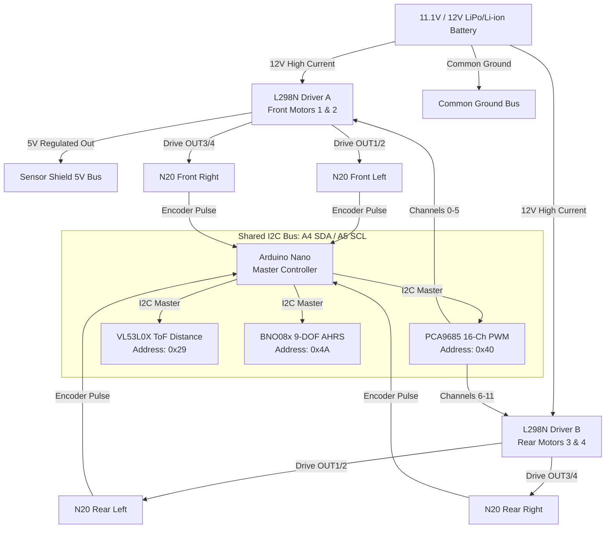

# Autonomous 4WD N20 Rover Project (IIT)

An autonomous robotic rover featuring 4-wheel drive skid-steering, high-resolution odometry, laser distance ranging, and 9-DOF inertial navigation.

---

## 📌 Executive Summary & Architecture

The rover is powered by an **Arduino Nano (ATmega328P)** mounted on a **Sensor Shield V3**. To eliminate microcontroller pin starvation and avoid serial communication conflicts on pins `D0` and `D1`, all motor actuation is offloaded to a **PCA9685 16-channel 12-bit PWM controller** over the **I2C bus (`A4/SDA`, `A5/SCL`)**. 

The same 2-wire I2C bus hosts a **VL53L0X Time-of-Flight laser distance sensor** and a **BNO08x 9-DOF AHRS IMU**, while the Nano's digital pins remain dedicated to high-speed encoder pulse interrupts.



---

## 📊 Current Project Status & Milestone Tracker

| Subsystem / Task | Status | Details & Notes |
| :--- | :---: | :--- |
| **Pinout Audit & Correction** | ✅ **Completed** | Fixed D0/D1 upload & PWM issue; transitioned motor driving to PCA9685. |
| **Mac Dev Environment** | ✅ **Completed** | Solved `avr-gcc` bad CPU type on Apple Silicon via Rosetta 2; compiler working. |
| **Bootloader Synchronization** | ✅ **Completed** | Identified 57600 baud `ATmega328P (Old Bootloader)` requirement. |
| **Hardware Architecture Spec** | ✅ **Completed** | Full wiring guide documented in `docs/WIRING_GUIDE.md`. |
| **Diagnostic Tool: I2C Scanner** | ✅ **Completed** | Tool created to verify all 3 I2C addresses (`0x29`, `0x40`, `0x4A`). |
| **Diagnostic Tool: Motor Test** | ✅ **Completed** | Zero-dependency PCA9685 motor testbench created in `tools/`. |
| **Master Rover Software** | ✅ **Completed** | Autonomous obstacle-avoidance controller with telemetry created in `src/`. |
| **Physical Wiring to PCA9685** | 🟡 **In Progress** | Moving L298N inputs to PCA9685 Channels 0–11 and wiring I2C bus. |
| **Hardware Bus Scan Verification** | ⏳ **Pending** | Flashing `01_I2C_Scanner.ino` to confirm live hardware communication. |
| **Wheel Spin Direction Check** | ⏳ **Pending** | Running `02_PCA9685_Motor_Test.ino` and swapping motor wires if reversed. |
| **PID Speed & Heading Tuning** | ⏳ **Pending** | Implementing closed-loop gyro-stabilized straight-line driving. |

---

## 🔌 COMPLETE MASTER PINOUT REFERENCE

### 1. Arduino Nano / Sensor Shield V3 Pin Mapping

| Arduino Nano Pin | Shield Row | Connected Subsystem / Signal | Description |
| :--- | :--- | :--- | :--- |
| **D0 (RX)** | D0 (S) | **UNCONNECTED** | Reserved for USB serial upload & Serial Monitor |
| **D1 (TX)** | D1 (S) | **UNCONNECTED** | Reserved for USB serial upload & Serial Monitor |
| **D2** | D2 (S) | **BNO08x Host Interrupt (`INT / H_INT`)** | External Interrupt 0 (`INT0`) - Low packet alert |
| **D3** | D3 (S) | **Motor 1 Encoder Channel A** | External Interrupt 1 (`INT1`) - Front Left ticks |
| **D4** | D4 (S) | **Motor 2 Encoder Channel A** | Pin Change Interrupt (`PCINT20`) - Front Right ticks |
| **D5** | D5 (S) | Unused / Spare | Available digital I/O |
| **D6** | D6 (S) | Unused / Spare | Available digital I/O |
| **D7** | D7 (S) | **Motor 3 Encoder Channel A** | Pin Change Interrupt (`PCINT23`) - Rear Left ticks |
| **D8** | D8 (S) | **Motor 4 Encoder Channel A** | Pin Change Interrupt (`PCINT0`) - Rear Right ticks |
| **D9** | D9 (S) | Unused / Spare | Available digital I/O / Hardware PWM |
| **D10** | D10 (S) | Unused / Spare | Available digital I/O / Hardware PWM |
| **D11** | D11 (S) | Unused / Spare | Available digital I/O |
| **D12** | D12 (S) | **BNO08x Reset (`RST`)** | Active-low hardware reset for IMU |
| **D13** | D13 (S) | **UNCONNECTED** | Onboard LED pin (kept free to prevent motor twitches) |
| **A0** | A0 (S) | Unused / Spare | Available analog or digital pin |
| **A1** | A1 (S) | Unused / Spare | Available analog or digital pin |
| **A2** | A2 (S) | Unused / Spare | Available analog or digital pin |
| **A3** | A3 (S) | Unused / Spare | Available analog or digital pin |
| **A4 (SDA)** | A4 (S) | **I2C Bus: SDA** | Connected to PCA9685, VL53L0X, and BNO08x SDA pins |
| **A5 (SCL)** | A5 (S) | **I2C Bus: SCL** | Connected to PCA9685, VL53L0X, and BNO08x SCL pins |
| **A6** | A6 (S) | Spare Analog Input | Analog input only (e.g., battery voltage sense) |
| **A7** | A7 (S) | Spare Analog Input | Analog input only |
| **5V (V)** | All V pins | **+5V Logic Power Rail** | Powers PCA9685, VL53L0X, BNO08x, and 4 Encoders |
| **GND (G)** | All G pins | **Common Ground Rail** | Shared ground across all boards and battery (-) |

---

### 2. PCA9685 16-Channel Controller Pinout

All L298N control lines connect to the **Signal (S)** pin row of the 3-pin headers (marked `PWM` or `S` on the board).

```
   PCA9685 Channel Header:
   [ S ]  <--- Wire to L298N terminal
   [ V+ ] <--- (Leave empty; used only for servos)
   [ G ]  <--- Common Ground
```

| PCA9685 Terminal | Target Device | L298N Terminal | Signal Purpose |
| :--- | :--- | :--- | :--- |
| **VCC (Side pin)** | Sensor Shield | **5V (V)** | Module logic supply (5V) |
| **GND (Side pin)** | Sensor Shield | **GND (G)** | Module logic ground |
| **SDA (Side pin)** | Sensor Shield | **A4 (S)** | I2C Data line |
| **SCL (Side pin)** | Sensor Shield | **A5 (S)** | I2C Clock line |
| **V+ (Screw block)**| — | **LEAVE EMPTY** | Not needed (only used when powering servos) |
| **Channel 0 (S)** | Driver A | **ENA** | Motor 1 Speed (12-bit PWM: 0–4095) |
| **Channel 1 (S)** | Driver A | **IN1** | Motor 1 Direction A |
| **Channel 2 (S)** | Driver A | **IN2** | Motor 1 Direction B |
| **Channel 3 (S)** | Driver A | **IN3** | Motor 2 Direction A |
| **Channel 4 (S)** | Driver A | **IN4** | Motor 2 Direction B |
| **Channel 5 (S)** | Driver A | **ENB** | Motor 2 Speed (12-bit PWM: 0–4095) |
| **Channel 6 (S)** | Driver B | **ENA** | Motor 3 Speed (12-bit PWM: 0–4095) |
| **Channel 7 (S)** | Driver B | **IN1** | Motor 3 Direction A |
| **Channel 8 (S)** | Driver B | **IN2** | Motor 3 Direction B |
| **Channel 9 (S)** | Driver B | **IN3** | Motor 4 Direction A |
| **Channel 10 (S)** | Driver B | **IN4** | Motor 4 Direction B |
| **Channel 11 (S)** | Driver B | **ENB** | Motor 4 Speed (12-bit PWM: 0–4095) |
| **Channels 12–15** | Spare | — | Free for future pan/tilt servos, arm, or LEDs |

---

### 3. L298N Dual Motor Drivers Pinout

#### Driver A (Front Left & Front Right Motors)
| Terminal | Connects To | Wire / Type | Function |
| :--- | :--- | :--- | :--- |
| **+12V Screw** | Battery (+) | High current wire | Motor high-voltage supply |
| **GND Screw** | Battery (-) & Shield GND | High current wire | Common system ground |
| **+5V Screw** | Shield **5V (V)** | Power wire | Supplies 5V to Nano & sensors (via 78M05) |
| **5V Jumper** | **INSTALLED (ON)** | Jumper cap | Enables onboard 5V regulator |
| **ENA** | PCA9685 **Channel 0 (S)** | Logic wire | Front Left speed PWM |
| **IN1** | PCA9685 **Channel 1 (S)** | Logic wire | Front Left direction bit 1 |
| **IN2** | PCA9685 **Channel 2 (S)** | Logic wire | Front Left direction bit 2 |
| **IN3** | PCA9685 **Channel 3 (S)** | Logic wire | Front Right direction bit 1 |
| **IN4** | PCA9685 **Channel 4 (S)** | Logic wire | Front Right direction bit 2 |
| **ENB** | PCA9685 **Channel 5 (S)** | Logic wire | Front Right speed PWM |
| **OUT1 & OUT2** | Motor 1 (Front Left) | Motor M+ / M- | Motor 1 power output |
| **OUT3 & OUT4** | Motor 2 (Front Right)| Motor M+ / M- | Motor 2 power output |

#### Driver B (Rear Left & Rear Right Motors)
| Terminal | Connects To | Wire / Type | Function |
| :--- | :--- | :--- | :--- |
| **+12V Screw** | Battery (+) | High current wire | Motor high-voltage supply |
| **GND Screw** | Battery (-) & Shield GND | High current wire | Common system ground |
| **+5V Screw** | **LEAVE EMPTY** | — | Do NOT wire (prevents regulator conflict with Driver A) |
| **5V Jumper** | **INSTALLED (ON)** | Jumper cap | Powers Driver B's internal logic gates |
| **ENA** | PCA9685 **Channel 6 (S)** | Logic wire | Rear Left speed PWM |
| **IN1** | PCA9685 **Channel 7 (S)** | Logic wire | Rear Left direction bit 1 |
| **IN2** | PCA9685 **Channel 8 (S)** | Logic wire | Rear Left direction bit 2 |
| **IN3** | PCA9685 **Channel 9 (S)** | Logic wire | Rear Right direction bit 1 |
| **IN4** | PCA9685 **Channel 10 (S)**| Logic wire | Rear Right direction bit 2 |
| **ENB** | PCA9685 **Channel 11 (S)**| Logic wire | Rear Right speed PWM |
| **OUT1 & OUT2** | Motor 3 (Rear Left) | Motor M+ / M- | Motor 3 power output |
| **OUT3 & OUT4** | Motor 4 (Rear Right)| Motor M+ / M- | Motor 4 power output |

---

### 4. N20 Motors & Encoders Pinout

Each N20 motor has a 6-pin connector on the rear Hall sensor PCB:

| Motor Pin Label | Connects To | Description |
| :--- | :--- | :--- |
| **M+ / M1** | L298N **OUT1** (or **OUT3**) | Motor power line (+) |
| **GND** | Sensor Shield **GND (G)** | Hall sensor logic ground (0V) |
| **C1 / A** | Arduino Nano **D3 / D4 / D7 / D8** | Encoder Channel A pulse output |
| **C2 / B** | (Optional / Unconnected) | Encoder Channel B (quadrature phase) |
| **3.3V–5V / VCC**| Sensor Shield **5V (V)** | Hall sensor logic power (powers green LED) |
| **M- / M2** | L298N **OUT2** (or **OUT4**) | Motor power line (-) |

#### Wheel-to-Nano Encoder Mapping (Channel A):
* **Motor 1 (Front Left):** Pin **D3 (S)** *(External Interrupt `INT1`)*
* **Motor 2 (Front Right):** Pin **D4 (S)** *(Pin Change Interrupt `PCINT20`)*
* **Motor 3 (Rear Left):** Pin **D7 (S)** *(Pin Change Interrupt `PCINT23`)*
* **Motor 4 (Rear Right):** Pin **D8 (S)** *(Pin Change Interrupt `PCINT0`)*

---

### 5. VL53L0X Laser Distance Sensor Pinout

| VL53L0X Pin | Target Connection | Sensor Shield Header | Function |
| :--- | :--- | :--- | :--- |
| **VIN** | Sensor Shield 5V Bus | **5V (V)** | 2.8V–5V Power supply |
| **GND** | Sensor Shield GND Bus | **GND (G)** | Common ground |
| **SCL** | Sensor Shield I2C SCL | **A5 (S)** | I2C Clock (Address: `0x29`) |
| **SDA** | Sensor Shield I2C SDA | **A4 (S)** | I2C Data line |
| **XSHUT** | (Leave Unconnected) | — | Hardware shutdown (internal pullup) |
| **GPIO1** | (Leave Unconnected) | — | Interrupt output (optional) |

---

### 6. BNO08x (BNO080 / BNO085) 9-DOF IMU Pinout

| BNO08x Pin | Target Connection | Sensor Shield Header | Function |
| :--- | :--- | :--- | :--- |
| **VIN / VCC** | Sensor Shield 5V Bus | **5V (V)** | 3.3V–5V Logic power |
| **GND** | Sensor Shield GND Bus | **GND (G)** | Common ground |
| **SCL** | Sensor Shield I2C SCL | **A5 (S)** | I2C Clock (Address: `0x4A`) |
| **SDA** | Sensor Shield I2C SDA | **A4 (S)** | I2C Data line |
| **INT / H_INT**| Arduino Nano Pin **D2** | **D2 (S)** | Host Interrupt (Active LOW alert) |
| **RST** | Arduino Nano Pin **D12** | **D12 (S)** | Hardware reset line |
| **DI0 / ADDR**| Sensor Shield GND Bus | **GND (G)** | Ties address to default `0x4A` |

---

## 🗂️ Project File Structure

```text
IIT/
├── README.md                          # Master project documentation & complete pinouts
├── docs/
│   └── WIRING_GUIDE.md                # Electrical specifications & architecture
├── tools/
│   ├── 01_I2C_Scanner/
│   │   └── 01_I2C_Scanner.ino         # Automated I2C health check (0x29, 0x40, 0x4A)
│   └── 02_PCA9685_Motor_Test/
│       └── 02_PCA9685_Motor_Test.ino # Zero-dependency 4-motor test sketch
└── src/
    ├── Robot_Simple/
    │   └── Robot_Simple.ino           # Lightweight trial sketch for preliminary testing
    └── Robot_Master/
        └── Robot_Master.ino           # Master integrated autonomous controller
```

---

## 🚀 Step-by-Step Execution Plan

### Step 1: Run the I2C Scanner
* **File:** `tools/01_I2C_Scanner/01_I2C_Scanner.ino`
* **Purpose:** Ensures PCA9685 (`0x40`), VL53L0X (`0x29`), and BNO08x (`0x4A`) are acknowledged on the bus.
* **Baud Rate:** `9600`
* **Success Criteria:** All three devices report `ONLINE [PASS]`.

### Step 2: Run the Motor Testbench
* **File:** `tools/02_PCA9685_Motor_Test/02_PCA9685_Motor_Test.ino`
* **Purpose:** Confirms forward/reverse rotation and 12-bit PWM speed control on all 4 wheels.
* **Baud Rate:** `9600`
* **Success Criteria:** Each motor spins forward then reverse in sequence, followed by all 4 wheels together.

### Step 3: Flash the Autonomous Rover Controller
* **File:** `src/Robot_Master/Robot_Master.ino`
* **Prerequisites:** `SparkFun BNO080 Cortex Based IMU` and `VL53L0X` (by Pololu) libraries (both installed and verified).
* **Baud Rate:** `115200`
* **Memory Footprint:** 18,228 bytes Flash (59%), 774 bytes RAM (37%) — perfectly fitted for ATmega328P.
* **Features:**
  * Real-time odometry streaming (tick count from all 4 encoders).
  * Millimeter-accuracy laser obstacle detection.
  * 3D IMU Euler angle tracking (Yaw, Pitch, Roll).
  * Autonomous reactive collision avoidance.
