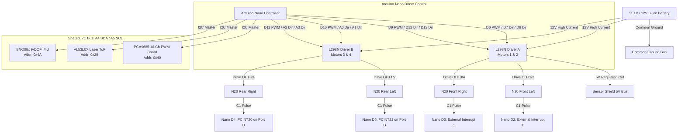

# Autonomous 4WD N20 Rover Project (IIT)

An autonomous robotic rover featuring 4-wheel drive skid-steering, high-resolution odometry, laser distance ranging, and 9-DOF inertial navigation.

---

## 📌 Executive Summary & Architecture

The rover is powered by an **Arduino Nano (ATmega328P)** mounted on a **Sensor Shield V3**. The system uses a dedicated, conflict-free pin mapping:
- **Direct Motor Drive:** Dual L298N motor drivers are controlled directly by the Arduino Nano using hardware PWM pins (`D6`, `D9`, `D10`, `D11`) and dedicated GPIO direction lines (`D7`, `D8`, `D12`, `D13`, `A0`, `A1`, `A2`, `A3`).
- **Dedicated Interrupt Encoders:** All 4 wheel encoders connect directly to hardware interrupt pins (`D2`, `D3`) and pin-change interrupt pins (`D4`, `D5`).
- **Shared I2C Spine:** The **I2C bus (`A4/SDA`, `A5/SCL`)** hosts the **PCA9685 PWM expansion board**, **VL53L0X Time-of-Flight laser distance sensor**, and **BNO08x 9-DOF AHRS IMU**.
- **100% Free UART:** Pins `D0 (RX)` and `D1 (TX)` are completely unencumbered, enabling continuous USB programming and high-speed telemetry debugging.

---

## 📊 Current Project Status & Milestone Tracker

| Subsystem / Task | Status | Details & Notes |
| :--- | :---: | :--- |
| **Direct Pinout Audit** | ✅ **Completed** | Conflict-free hardware pin mapping finalized and verified. |
| **Bootloader & Toolchain** | ✅ **Completed** | Configured for `ATmega328P (Old Bootloader)` at 57600 baud. |
| **Hardware Architecture Spec** | ✅ **Completed** | Full wiring guide updated in `docs/WIRING_GUIDE.md`. |
| **Diagnostic Test Suite** | ✅ **Completed** | Full diagnostic suite in `tools/03_Direct_Hardware_Diagnostic_Test/`. |
| **Autonomous Master Software** | ✅ **Completed** | Production controller updated in `src/Robot_Master/`. |
| **Simple Trial Software** | ✅ **Completed** | Standalone obstacle test updated in `src/Robot_Simple/`. |
| **Interactive Dashboard** | ✅ **Completed** | `Robot 2 Dashboard.html` — Run `start_network_dashboard.bat` to access from other computers over Wi-Fi/LAN (`http://<IP>:8080/`). |

---

## 🔌 COMPLETE MASTER PINOUT REFERENCE

### 1. Arduino Nano / Sensor Shield V3 Pin Mapping

| Arduino Nano Pin | Shield Row | Connected Subsystem / Signal | Hardware Function | Status |
| :--- | :--- | :--- | :--- | :--- |
| **D0 (RX)** | D0 (S) | **UNCONNECTED** | USB Serial Upload & Debug | ✅ Safe & Free |
| **D1 (TX)** | D1 (S) | **UNCONNECTED** | USB Serial Upload & Debug | ✅ Safe & Free |
| **D2** | D2 (S) | **Motor 1 Encoder Signal (C1)** | External Interrupt 0 (`INT0`) | ✅ Dedicated |
| **D3** | D3 (S) | **Motor 2 Encoder Signal (C1)** | External Interrupt 1 (`INT1`) | ✅ Dedicated |
| **D4** | D4 (S) | **Motor 4 Encoder Signal (C1)** | Pin Change Interrupt (`PCINT20`) | ✅ Dedicated |
| **D5** | D5 (S) | **Motor 3 Encoder Signal (C1)** | Pin Change Interrupt (`PCINT21`) | ✅ Dedicated |
| **D6** | D6 (S) | **Driver A: ENA (Motor 1 Speed)** | Hardware PWM (`Timer0A`) | ✅ Dedicated |
| **D7** | D7 (S) | **Driver A: IN1 (Motor 1 Dir A)** | Digital GPIO | ✅ Dedicated |
| **D8** | D8 (S) | **Driver A: IN2 (Motor 1 Dir B)** | Digital GPIO | ✅ Dedicated |
| **D9** | D9 (S) | **Driver A: ENB (Motor 2 Speed)** | Hardware PWM (`Timer1A`) | ✅ Dedicated |
| **D10** | D10 (S) | **Driver B: ENA (Motor 3 Speed)** | Hardware PWM (`Timer1B`) | ✅ Dedicated |
| **D11** | D11 (S) | **Driver B: ENB (Motor 4 Speed)** | Hardware PWM (`Timer2A`) | ✅ Dedicated |
| **D12** | D12 (S) | **Driver A: IN3 (Motor 2 Dir A)** | Digital GPIO | ✅ Dedicated |
| **D13** | D13 (S) | **Driver A: IN4 (Motor 2 Dir B)** | Digital GPIO (Onboard LED line) | ✅ Dedicated |
| **A0** | A0 (S) | **Driver B: IN1 (Motor 3 Dir A)** | Digital GPIO (`D14`) | ✅ Dedicated |
| **A1** | A1 (S) | **Driver B: IN2 (Motor 3 Dir B)** | Digital GPIO (`D15`) | ✅ Dedicated |
| **A2** | A2 (S) | **Driver B: IN3 (Motor 4 Dir A)** | Digital GPIO (`D16`) | ✅ Dedicated |
| **A3** | A3 (S) | **Driver B: IN4 (Motor 4 Dir B)** | Digital GPIO (`D17`) | ✅ Dedicated |
| **A4 (SDA)** | A4 (S) / SDA | **I2C Bus: SDA** | Hardware I2C (PCA9685, VL53L0X, BNO08x) | ✅ Shared Bus |
| **A5 (SCL)** | A5 (S) / SCL | **I2C Bus: SCL** | Hardware I2C (PCA9685, VL53L0X, BNO08x) | ✅ Shared Bus |
| **A6** | A6 (S) | Spare Analog Input Only | Available (e.g. Battery Voltage Monitor) | ⚪ Spare |
| **A7** | A7 (S) | Spare Analog Input Only | Available (e.g. Current Sense) | ⚪ Spare |
| **5V (V)** | All V pins | **+5V Logic Power Rail** | Powered from Driver A 5V Regulator | ✅ Connected |
| **GND (G)** | All G pins | **Common Ground Plane** | Common Ground for all logic & battery | ✅ Connected |

---

### 2. Dual L298N Motor Drivers Pinout

#### Driver A (Motors 1 & 2: Front Left & Front Right)
| L298N Terminal | Target Motor | Nano Pin | Shield Header | Function / Signal |
| :--- | :--- | :--- | :--- | :--- |
| **ENA** | Motor 1 | **D6** | D6 (S) | Speed PWM (0–255) |
| **IN1** | Motor 1 | **D7** | D7 (S) | Direction Bit A |
| **IN2** | Motor 1 | **D8** | D8 (S) | Direction Bit B |
| **IN3** | Motor 2 | **D12** | D12 (S) | Direction Bit A |
| **IN4** | Motor 2 | **D13** | D13 (S) | Direction Bit B |
| **ENB** | Motor 2 | **D9** | D9 (S) | Speed PWM (0–255) |
| **OUT1 / OUT2** | Motor 1 | — | — | Front Left N20 Terminals |
| **OUT3 / OUT4** | Motor 2 | — | — | Front Right N20 Terminals |

#### Driver B (Motors 3 & 4: Rear Left & Rear Right)
| L298N Terminal | Target Motor | Nano Pin | Shield Header | Function / Signal |
| :--- | :--- | :--- | :--- | :--- |
| **ENA** | Motor 3 | **D10** | D10 (S) | Speed PWM (0–255) |
| **IN1** | Motor 3 | **A0** | A0 (S) | Direction Bit A |
| **IN2** | Motor 3 | **A1** | A1 (S) | Direction Bit B |
| **IN3** | Motor 4 | **A2** | A2 (S) | Direction Bit A |
| **IN4** | Motor 4 | **A3** | A3 (S) | Direction Bit B |
| **ENB** | Motor 4 | **D11** | D11 (S) | Speed PWM (0–255) |
| **OUT1 / OUT2** | Motor 3 | — | — | Rear Left N20 Terminals |
| **OUT3 / OUT4** | Motor 4 | — | — | Rear Right N20 Terminals |

---

### 3. Encoder Pinout (C1 Pulse Signals)

| Physical Motor | VCC Pin | GND Pin | Signal Pin (C1) | Shield Header | Interrupt Architecture |
| :--- | :--- | :--- | :--- | :--- | :--- |
| **Motor 1 (Front Left)** | VCC | GND | C1 | **D2** (V, G, S) | External Interrupt 0 (`INT0`) |
| **Motor 2 (Front Right)**| VCC | GND | C1 | **D3** (V, G, S) | External Interrupt 1 (`INT1`) |
| **Motor 3 (Rear Left)** | VCC | GND | C1 | **D5** (V, G, S) | Pin Change Interrupt 2 (`PCINT21`) |
| **Motor 4 (Rear Right)**| VCC | GND | C1 | **D4** (V, G, S) | Pin Change Interrupt 2 (`PCINT20`) |

---

## 🛠 Diagnostic & Testing Software

A dedicated diagnostic test suite is available in `tools/03_Direct_Hardware_Diagnostic_Test/`:
* **Menu-Driven Interactive Testing:**
  * Option `1`: Test Motor 1 (D6, D7, D8) + verify D2 encoder ticks.
  * Option `2`: Test Motor 2 (D9, D12, D13) + verify D3 encoder ticks.
  * Option `3`: Test Motor 3 (D10, A0, A1) + verify D5 encoder ticks.
  * Option `4`: Test Motor 4 (D11, A2, A3) + verify D4 encoder ticks.
  * Option `5`: Combined 4WD drive cycle (Forward, Reverse, Spin Left, Spin Right).
  * Option `6`: Real-time continuous encoder monitor for all 4 wheels.
  * Option `7`: I2C Bus Scanner (`0x40`, `0x29`, `0x4A`).
  * Option `8`: Automated full hardware self-test routine.
  * Option `S`: Emergency stop.

---

## 🚀 How to Run the Software

1. Open `tools/03_Direct_Hardware_Diagnostic_Test/03_Direct_Hardware_Diagnostic_Test.ino` in Arduino IDE or VS Code.
2. Select Board: **Arduino Nano**, Processor: **ATmega328P (Old Bootloader)**.
3. Upload the sketch and open **Serial Monitor** at **115200 baud**.
4. Type numbers `1` through `8` to run hardware diagnostics or `S` to stop!
