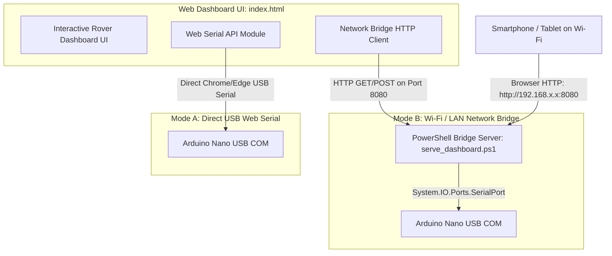
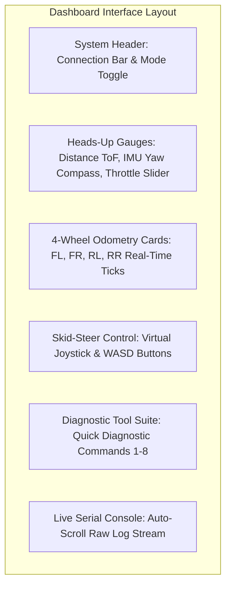

# 🌐 Telemetry Ground Station & Network Bridge Guide: 4WD N20 Rover

This document describes the design, architecture, setup, and operation of the **Interactive Telemetry Dashboard** for the 4WD N20 Rover.

---

## 🖥️ Overview & Dual-Connection Architecture

The rover ground control station operates in two distinct connectivity modes to accommodate direct bench testing and wireless remote field driving:



| Connection Mode | Primary Use Case | Requirements | Supported Devices |
| :--- | :--- | :--- | :--- |
| **Mode A: Direct Web Serial** | Bench testing and local USB tethering. | Chrome, Edge, or Opera on Windows, macOS, or Linux. | Desktop / Laptop PC |
| **Mode B: Wi-Fi Network Bridge** | Wireless teleoperation and multi-device telemetry. | Host PC running `serve_dashboard.ps1` connected to rover via USB. | Any phone, tablet, iPad, or remote laptop on the same Wi-Fi network. |

---

## 🚀 How to Launch the Network Dashboard Server

### Method 1: One-Click Windows Launcher (Recommended)
1. Plug the Arduino Nano into your host PC via USB.
2. In the project root directory, double-click:
   ```text
   start_dashboard.bat
   ```
   *(or double-click `dashboard/start_network_dashboard.bat`)*
3. A PowerShell console will open and automatically launch your default browser to `http://localhost:8080/`.

### Method 2: Manual PowerShell Command
If running from a terminal or customizing the listening port:
```powershell
powershell -NoProfile -ExecutionPolicy Bypass -File .\dashboard\serve_dashboard.ps1 -Port 8080
```

### Accessing Remotely from Smartphones or Tablets:
1. Ensure your mobile phone or tablet is connected to the same Wi-Fi router as your host PC.
2. Look at the server console output upon startup:
   ```text
   ============================================================
          IIT-RB2: ROBOT 2 DASHBOARD NETWORK HTTP SERVER       
   ============================================================
     [LOCAL PC]     http://localhost:8080/
     [NETWORK/LAN]  http://192.168.1.45:8080/
   ```
3. Type the **`http://<YOUR_IP>:8080/`** address into Safari, Chrome, or Firefox on your mobile device.
4. On the mobile screen, click **Connect Wi-Fi Bridge** to begin teleoperating wirelessly!

---

## 📡 Network Bridge Server REST API Reference

The bundled server script ([`serve_dashboard.ps1`](../dashboard/serve_dashboard.ps1)) implements a lightweight HTTP REST API on port `8080`. External programs, Python scripts, or custom UIs can interface with the rover using these endpoints:

### 1. `GET /api/ports`
* **Description**: Lists all available hardware COM ports on the host system.
* **Response**:
  ```json
  [
    {"name": "COM3", "caption": "USB-SERIAL CH340 (COM3)"},
    {"name": "COM4", "caption": "Arduino Nano (COM4)"}
  ]
  ```

### 2. `POST /api/connect`
* **Description**: Opens a serial bridge connection to the designated COM port.
* **Query Parameters**:
  * `port` (e.g., `COM3`)
  * `baud` (default: `115200`)
* **Response**:
  ```json
  {"status": "ok", "message": "Connected to COM3 at 115200 Baud"}
  ```

### 3. `POST /api/disconnect`
* **Description**: Closes the active COM port and releases the serial lock.
* **Response**:
  ```json
  {"status": "ok", "message": "Disconnected"}
  ```

### 4. `POST /api/send`
* **Description**: Sends an ASCII command string to the rover firmware.
* **Request Body**: Raw string or JSON payload containing the command (e.g., `M:180,180` or `STOP`).
* **Response**:
  ```json
  {"status": "ok", "sent": "M:180,180"}
  ```

### 5. `GET /api/telemetry`
* **Description**: Fetches recent lines from the rolling serial buffer.
* **Response**:
  ```json
  {
    "connected": true,
    "port": "COM3",
    "baud": 115200,
    "lines": [
      "Dist: 340 mm | Yaw: 4.2 deg | Ticks [FL:120 FR:118 RL:120 RR:119]",
      "Dist: 338 mm | Yaw: 4.1 deg | Ticks [FL:145 FR:144 RL:145 RR:143]"
    ]
  }
  ```

---

## 🎮 Dashboard User Interface Walkthrough



### 1. Connection Header
* **Connect USB (Web Serial):** Directly claims the USB serial port via your browser. Best for low-latency tethered bench testing.
* **Connect Wi-Fi Bridge:** Links to `serve_dashboard.ps1` via HTTP polling. Best for wireless mobile control.
* **Emergency Stop (E-STOP):** Prominently styled in high-visibility red. Immediately sends `STOP` to freeze all motors.

### 2. Heads-Up Gauges & Metrics
* **Laser Distance Bar:** Real-time distance reading from the front VL53L0X sensor. Turns yellow when approaching an obstacle (< 400 mm) and red under the safety threshold (< 180 mm).
* **IMU Heading Compass:** Displays current yaw heading in degrees with a graphical orientation compass needle.
* **Throttle Multiplier:** Slider adjusting default motor PWM between `60` and `220`.

### 3. 4-Wheel Encoder Odometry Grid
* Shows independent tick counters for **Front-Left (FL)**, **Front-Right (FR)**, **Rear-Left (RL)**, and **Rear-Right (RR)**.
* Includes tick delta and estimated wheel rotational speed.

### 4. Drive Teleoperation Controls
* **Virtual Touch Joystick:** Smooth 2D touch joystick for phones and tablets. Computes proportional differential skid-steer PWM and sends `M:left,right` packets.
* **Directional Buttons:** Discrete `Forward`, `Backward`, `Pivot Left`, and `Pivot Right` triggers.
* **Keyboard Hotkeys:**
  * `W` or `↑`: Drive Forward
  * `S` or `↓`: Drive Backward
  * `A` or `←`: Pivot Left
  * `D` or `→`: Pivot Right
  * `Spacebar`: Emergency Stop

### 5. Live Console & Diagnostics
* Built-in serial console displaying incoming responses from the controller.
* One-click trigger buttons for hardware diagnostic self-tests (`TEST:1` through `TEST:COMBINED`).
