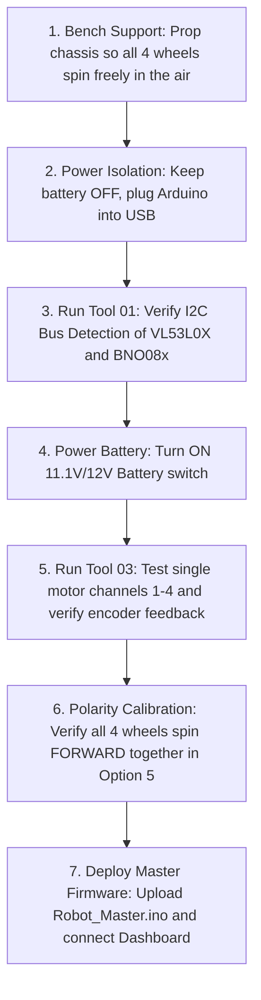
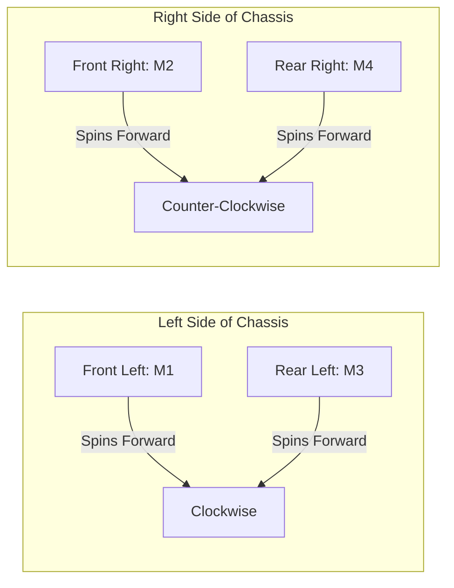

# 🛠 Diagnostics, Bench Testing & Calibration Guide: 4WD N20 Rover

This guide outlines the systematic bench commissioning and calibration procedure for the **4WD N20 Rover (IIT-RB2)** using the standalone diagnostic suite located in the `tools/` directory.

---

## 📋 Bench Commissioning Checklist

Before placing the rover on the floor and powering on the high-current battery, complete this verification sequence on a test bench:



---

## 🧰 The Diagnostic Tool Suite

The `tools/` folder contains three zero-dependency diagnostic firmware sketches:

| Tool Directory | Sketch File | Baud Rate | Primary Function |
| :--- | :--- | :---: | :--- |
| **`01_I2C_Scanner/`** | [`01_I2C_Scanner.ino`](../tools/01_I2C_Scanner/01_I2C_Scanner.ino) | **9600** | Automated I2C address discovery for sensors and expansion boards. |
| **`02_PCA9685_Motor_Test/`** | [`02_PCA9685_Motor_Test.ino`](../tools/02_PCA9685_Motor_Test/02_PCA9685_Motor_Test.ino) | **9600** | Bench verification for auxiliary PCA9685 16-channel PWM setups. |
| **`03_Direct_Hardware_Diagnostic_Test/`** | [`03_Direct_Hardware_Diagnostic_Test.ino`](../tools/03_Direct_Hardware_Diagnostic_Test/03_Direct_Hardware_Diagnostic_Test.ino) | **115200** | ⭐ **Full Interactive Diagnostic Suite** for the direct-pinout architecture. |

---

## 🔍 Tool 1: I2C Bus Scanner (`01_I2C_Scanner`)

### Objective:
Verify that all shared I2C peripherals on lines **`A4` (SDA)** and **`A5` (SCL)** are powered, recognized, and conflict-free.

### Procedure:
1. Open [`tools/01_I2C_Scanner/01_I2C_Scanner.ino`](../tools/01_I2C_Scanner/01_I2C_Scanner.ino) in Arduino IDE.
2. Board: **Arduino Nano**, Processor: **ATmega328P (Old Bootloader)**.
3. Upload sketch and open Serial Monitor at **9600 baud**.
4. The scanner scans addresses `0x01` through `0x7E` continuously.

### Expected Serial Output:
```text
================================================
       N20 ROVER: I2C BUS HARDWARE SCANNER       
================================================
Scanning I2C Bus (A4=SDA, A5=SCL)...

--- Beginning New Bus Scan ---
[OK] Found device at 7-bit address 0x29 : VL53L0X Time-of-Flight Distance Sensor
[OK] Found device at 7-bit address 0x4A : BNO08x 9-DOF IMU (Gyroscope / Accelerometer)
[OK] Found device at 7-bit address 0x40 : PCA9685 16-Channel 12-Bit PWM Controller (if attached)
Scan complete: 2 devices verified on shared I2C bus.
```

### Diagnostic Criteria:
* If `0x29` is missing: Check VL53L0X VCC (5V/3.3V), GND, SDA (A4), and SCL (A5).
* If `0x4A` is missing: Check if BNO08x is responding at `0x4B` (DI0/ADDR pin floating/high) or wiring is loose.
* If 0 devices found: The I2C bus is missing pullup resistors or held low by a faulty ground connection.

---

## ⚡ Tool 3: Direct Hardware Diagnostic Test (`03_Direct_Hardware_Diagnostic_Test`)

This is the primary bench validation tool for the audited direct-pinout architecture.

### Procedure:
1. Open [`tools/03_Direct_Hardware_Diagnostic_Test/03_Direct_Hardware_Diagnostic_Test.ino`](../tools/03_Direct_Hardware_Diagnostic_Test/03_Direct_Hardware_Diagnostic_Test.ino).
2. Upload sketch and open Serial Monitor at **115200 baud** (with line ending set to **Both NL & CR**).
3. The interactive menu displays upon boot:

```text
======================================================================
  IIT-RB2: DIRECT HARDWARE DIAGNOSTIC & VERIFICATION TEST SUITE
======================================================================
  [1] Test Motor 1 (Front Left)  : D6 PWM, D7/D8 Dir  + D2 Encoder
  [2] Test Motor 2 (Front Right) : D9 PWM, D12/D13 Dir + D3 Encoder
  [3] Test Motor 3 (Rear Left)   : D10 PWM, A0/A1 Dir + D5 Encoder
  [4] Test Motor 4 (Rear Right)  : D11 PWM, A2/A3 Dir + D4 Encoder
  [5] Test All Motors (4WD Combined Forward / Reverse / Spin Cycle)
  [6] Live Encoders Monitor (Spin wheels by hand to verify ticks)
  [7] I2C Bus Scanner (Auto-discover 0x40, 0x29, 0x4A)
  [8] Run Automated Full System Self-Test
  [S] EMERGENCY STOP ALL MOTORS
======================================================================
```

### Menu Options Detailed Breakdown:

#### `[1]` Test Motor 1 (Front Left)
* Drives Motor 1 forward at PWM 180 for 1.2s, stops for 0.4s, drives reverse for 1.2s, and stops.
* Reads ticks accumulated on **D2 (INT0)** before and after motion.
* **Pass criteria:** Wheel spins forward then backward smoothly, and encoder delta is `> 50 ticks`.

#### `[2]` Test Motor 2 (Front Right)
* Drives Motor 2 forward then reverse via **D9 (PWM)** and **D12/D13 (Directions)**.
* Reads ticks on **D3 (INT1)**.
* **Pass criteria:** Wheel spins smoothly; encoder delta is `> 50 ticks`.

#### `[3]` Test Motor 3 (Rear Left)
* Drives Motor 3 forward then reverse via **D10 (PWM)** and **A0/A1 (Directions)**.
* Reads ticks on **D5 (PCINT21)**.
* **Pass criteria:** Wheel spins smoothly; encoder delta is `> 50 ticks`.

#### `[4]` Test Motor 4 (Rear Right)
* Drives Motor 4 forward then reverse via **D11 (PWM)** and **A2/A3 (Directions)**.
* Reads ticks on **D4 (PCINT20)**.
* **Pass criteria:** Wheel spins smoothly; encoder delta is `> 50 ticks`.

#### `[5]` Test All Motors Combined (4WD Drive Cycle)
* Executes the complete skid-steer movement cycle:
  1. Forward for 1.5 seconds.
  2. Backward for 1.5 seconds.
  3. Spin Left for 1.0 second.
  4. Spin Right for 1.0 second.
  5. Full Stop.
* **Pass criteria:** All 4 wheels spin simultaneously in identical directions during forward/backward.

#### `[6]` Live Encoders Monitor (Manual Spin Test)
* Streams live tick counts for FL, FR, RL, and RR every 100 ms.
* While active, rotate each wheel by hand 1 full turn to verify tick increments.
* Send `X` to exit back to the main menu.

#### `[7]` Real-time I2C Bus Scan
* Rapidly queries TWI bus and reports active hardware addresses.

#### `[8]` Automated Full System Self-Test
* Runs sequential tests 1 through 4 followed by I2C verification and combined motion, printing a final PASS/FAIL summary table.

---

## 🔄 Motor Polarity & Mechanical Mirroring Calibration

### The Symmetrical Chassis Issue:
In a 4WD rover chassis, motors on the right side of the vehicle face in the physically opposite orientation compared to motors on the left side:
* If both left and right motors are wired with positive lead to `OUT1` and negative lead to `OUT2`, the left wheels will turn forward while the right wheels turn backward!
* This will cause the rover to spin in circles instead of driving forward.



### Calibration Procedure:
1. Run Option `5` in Diagnostic Tool `03` (Forward Drive).
2. Observe all 4 wheels:
   * **Left wheels (M1, M3):** Should spin such that top of wheel moves toward front of chassis.
   * **Right wheels (M2, M4):** Should spin in the exact same forward ground direction.
3. If any wheel turns backward during forward drive:
   * Power off battery.
   * Swap the two motor wires on that wheel's L298N screw terminal pair (e.g., switch wire in `OUT1` with wire in `OUT2`).
   * Power on and re-test.

---

## 📏 Wheel Odometry & Distance Calibration

The N20 gearmotors feature magnetic Hall-effect encoders attached directly to the motor armature:

| Parameter | Nominal Value | Notes |
| :--- | :--- | :--- |
| **Encoder Pulses per Motor Rev (Armature)** | 7 pulses | Hall sensor disk with 7 magnetic pole pairs |
| **Gear Reduction Ratio** | ~30:1 (or 50:1) | Depending on exact N20 gearbox model installed |
| **Output Shaft Ticks per Rev** | ~210 to 350 ticks | `7 pulses * Gear Ratio` |
| **Wheel Diameter ($D$)** | 43 mm (0.043 m) | Standard rubber rim |
| **Wheel Circumference ($C$)** | $\pi \times D \approx 135.1\text{ mm}$ | Distance traveled per single wheel turn |

### Measuring Your Robot's Exact Ticks Per Millimeter:
1. Run Tool `03`, Option `6` (Live Encoders Monitor).
2. Note initial tick count.
3. Push the rover forward on a flat surface along a meter ruler for exactly **1,000 mm (1 meter)**.
4. Note final tick count:
   $$\text{Ticks per mm} = \frac{\text{Delta Ticks}}{1000\text{ mm}}$$
5. In your high-level navigation code, compute distance traveled:
   $$\text{Distance (mm)} = \frac{\text{Ticks}}{\text{Ticks per mm}}$$
