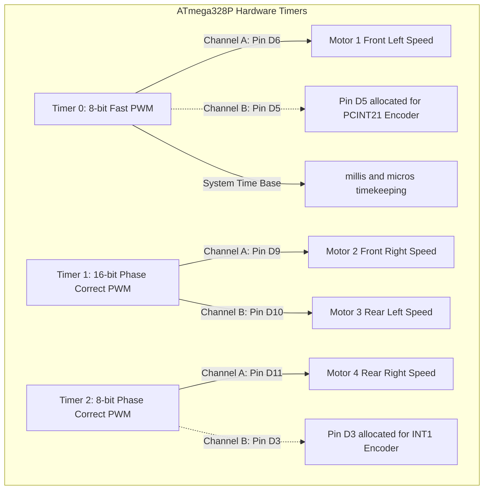
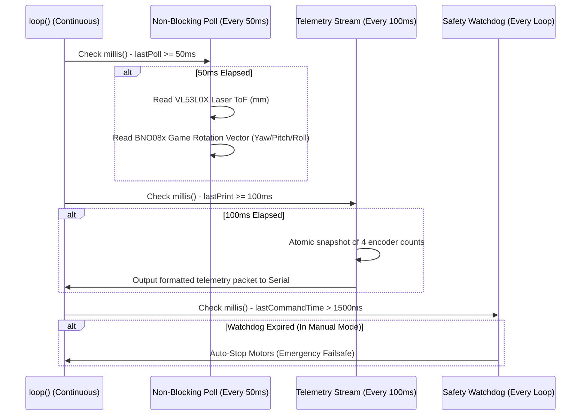

# 💻 Firmware Architecture & Protocol Guide: 4WD N20 Rover

This document provides a comprehensive technical breakdown of the embedded firmware powering the **4WD N20 Rover (IIT-RB2)**. It details microcontroller timer allocation, interrupt service routines (ISRs), sensor polling loops, state machines, the serial command API, and the real-time telemetry protocol.

---

## 🎯 Firmware Overview & Targets

The repository provides two distinct firmware targets located in `src/`:

| Firmware Target | Source File | Baud Rate | Flash Size | Key Features |
| :--- | :--- | :---: | :---: | :--- |
| **Robot Master Controller** | [`src/Robot_Master/Robot_Master.ino`](../src/Robot_Master/Robot_Master.ino) | **115200** | ~18 KB | Full production firmware: Dual L298N direct PWM, 4-wheel interrupt odometry, I2C VL53L0X ToF, BNO08x 9-DOF IMU, Web Dashboard telemetry stream (10 Hz), and safety watchdog. |
| **Robot Simple Trial** | [`src/Robot_Simple/Robot_Simple.ino`](../src/Robot_Simple/Robot_Simple.ino) | **9600** | ~8 KB | Lightweight obstacle avoidance sketch: Direct L298N drive + VL53L0X laser sensor. Zero gyro/IMU dependencies, minimal RAM footprint for rapid bench trials. |

---

## ⏱ Hardware Pin & Timer Mapping

The **ATmega328P** microchip contains three internal hardware timers. Motor speed control (PWM) has been carefully mapped to eliminate timer conflicts with Arduino system functions:



### Complete Pin Assignment Table

| Signal Name | Arduino Pin | Register / Bit | Mode | Description / Subsystem |
| :--- | :---: | :--- | :--- | :--- |
| `M1_ENA` | `D6` | `PORTD6 / OC0A` | `OUTPUT` | Hardware PWM: Front Left Speed |
| `M1_IN1` | `D7` | `PORTD7` | `OUTPUT` | Digital GPIO: Front Left Direction Bit A |
| `M1_IN2` | `D8` | `PORTB0` | `OUTPUT` | Digital GPIO: Front Left Direction Bit B |
| `M2_ENB` | `D9` | `PORTB1 / OC1A` | `OUTPUT` | Hardware PWM: Front Right Speed |
| `M2_IN3` | `D12` | `PORTB4` | `OUTPUT` | Digital GPIO: Front Right Direction Bit A |
| `M2_IN4` | `D13` | `PORTB5` | `OUTPUT` | Digital GPIO: Front Right Direction Bit B (Nano LED) |
| `M3_ENA` | `D10` | `PORTB2 / OC1B` | `OUTPUT` | Hardware PWM: Rear Left Speed |
| `M3_IN1` | `A0` | `PORTC0 / D14` | `OUTPUT` | Digital GPIO: Rear Left Direction Bit A |
| `M3_IN2` | `A1` | `PORTC1 / D15` | `OUTPUT` | Digital GPIO: Rear Left Direction Bit B |
| `M4_ENB` | `D11` | `PORTB3 / OC2A` | `OUTPUT` | Hardware PWM: Rear Right Speed |
| `M4_IN3` | `A2` | `PORTC2 / D16` | `OUTPUT` | Digital GPIO: Rear Right Direction Bit A |
| `M4_IN4` | `A3` | `PORTC3 / D17` | `OUTPUT` | Digital GPIO: Rear Right Direction Bit B |
| `ENC1_PIN` | `D2` | `PORTD2 / INT0` | `INPUT_PULLUP` | External Interrupt 0: Front Left Encoder C1 |
| `ENC2_PIN` | `D3` | `PORTD3 / INT1` | `INPUT_PULLUP` | External Interrupt 1: Front Right Encoder C1 |
| `ENC4_PIN` | `D4` | `PORTD4 / PCINT20` | `INPUT_PULLUP` | Pin Change Interrupt 2: Rear Right Encoder C1 |
| `ENC3_PIN` | `D5` | `PORTD5 / PCINT21` | `INPUT_PULLUP` | Pin Change Interrupt 2: Rear Left Encoder C1 |
| `I2C_SDA` | `A4` | `PORTC4 / SDA` | `INPUT_PULLUP` | Hardware I2C Data: VL53L0X, BNO08x, PCA9685 |
| `I2C_SCL` | `A5` | `PORTC5 / SCL` | `INPUT_PULLUP` | Hardware I2C Clock: VL53L0X, BNO08x, PCA9685 |
| `UART_RX` | `D0` | `PORTD0 / RXD` | `INPUT` | USB Serial Communication (Unencumbered) |
| `UART_TX` | `D1` | `PORTD1 / TXD` | `OUTPUT` | USB Serial Communication (Unencumbered) |

---

## ⚡ High-Resolution Odometry & Interrupt Handlers

To track all 4 wheels simultaneously without missing encoder pulses during high-speed rotation, `Robot_Master.ino` uses a hybrid interrupt architecture:

### 1. Dedicated External Interrupts (`D2` and `D3`)
* **Motor 1 (Front Left):** `attachInterrupt(digitalPinToInterrupt(2), isrEncoder1, RISING)`
* **Motor 2 (Front Right):** `attachInterrupt(digitalPinToInterrupt(3), isrEncoder2, RISING)`
* Each rising edge triggers an instant, single-cycle increment of `encTicks1` and `encTicks2`.

### 2. Port D Pin-Change Interrupt (`D4` and `D5`)
The ATmega328P only has two dedicated external interrupt pins (`D2`, `D3`). Motors 3 and 4 are handled via **Pin Change Interrupt 2** on `PORT D`:
* Both pins reside on Port D (`PIND4` and `PIND5`).
* In `setup()`, the pin change mask register enables both lines:
  ```cpp
  PCMSK2 |= (1 << PCINT20) | (1 << PCINT21); // Enable D4 & D5
  PCICR  |= (1 << PCIE2);                    // Arm PCINT2 vector
  ```
* In `ISR(PCINT2_vect)`, atomic port reading with bitmasking calculates rising edges:
  ```cpp
  ISR(PCINT2_vect) {
    uint8_t curr = PIND;
    // D4: Motor 4 (Rear Right) rising edge check
    if ((curr & (1 << PIND4)) && !(lastPIND & (1 << PIND4))) {
      encTicks4++;
    }
    // D5: Motor 3 (Rear Left) rising edge check
    if ((curr & (1 << PIND5)) && !(lastPIND & (1 << PIND5))) {
      encTicks3++;
    }
    lastPIND = curr;
  }
  ```

### 3. Thread-Safe Atomic Reading
Because `encTicks1` through `encTicks4` are multi-byte `volatile long` variables modified inside ISRs, reading them in the main loop while interrupts are firing could cause torn reads. `Robot_Master.ino` uses `<util/atomic.h>`:
```cpp
long t1, t2, t3, t4;
ATOMIC_BLOCK(ATOMIC_RESTORESTATE) {
  t1 = encTicks1;
  t2 = encTicks2;
  t3 = encTicks3;
  t4 = encTicks4;
}
```

---

## 📡 Sensor Integration Pipeline

To maintain responsive motor control and sub-millisecond loop times, sensors are updated in a non-blocking 50 ms cadence (`20 Hz`) rather than stalling `loop()`:



### I2C Bus Robustness Features:
1. **400 kHz Fast-Mode:** `Wire.setClock(400000)` reduces I2C transaction latency by 75% compared to default 100 kHz.
2. **Bus Timeout Guard:** `Wire.setWireTimeout(3000, true)` automatically resets the hardware TWI state machine if a sensor hangs, preventing the Arduino from freezing.
3. **VL53L0X Guard:** `lox.setTimeout(80)` ensures ranging delays never block subsequent code execution.

---

## 🔄 Operating Modes & Autonomous State Machine

The master firmware supports four operating modes via `enum OperatingMode`:

1. **`OP_MANUAL` (Manual Teleoperation):**
   * Default mode on boot.
   * Responds to keyboard keys (WASD), virtual dashboard joysticks, or serial drive commands.
   * Protected by the 1500 ms safety watchdog.
2. **`OP_AUTO` (Autonomous Obstacle Avoidance):**
   * Uses laser ranging from the front VL53L0X sensor.
   * When an obstacle is detected within `STOP_DIST_MM` (180 mm), the non-blocking state machine executes:
     ```mermaid
     stateDiagram-v2
         [*] --> STATE_FORWARD
         STATE_FORWARD --> STATE_STOP: Distance < 180mm
         STATE_STOP --> STATE_BACKWARD: Wait 200ms
         STATE_BACKWARD --> STATE_TURN: Reverse for 400ms
         STATE_TURN --> STATE_FORWARD: Pivot Right for 500ms
     ```
3. **`OP_SPIN` (Benchmark 360° Spin):**
   * Rotates in place at active throttle to test traction, differential skid-steering balance, and IMU heading responsiveness.
4. **`OP_ESTOP` (Emergency Stop Locked):**
   * Hardware safety interlock.
   * Shuts off all 4 PWM outputs instantly.
   * Rejects all motion commands until an explicit `RESUME` command is received.

---

## 💬 Serial Command Protocol

All commands are ASCII strings terminated with `\r` (carriage return), `\n` (newline), or both (`\r\n`). Baud rate: **115200**.

### 1. Motion & Drive Commands

| Command Syntax | Parameters | Description | Example |
| :--- | :--- | :--- | :--- |
| `M:<left>,<right>` | `left`: -220 to 220<br>`right`: -220 to 220 | Differential skid-steer drive. Directly sets PWM and direction for left (M1, M3) and right (M2, M4) wheel pairs. | `M:180,180` (Forward)<br>`M:-160,160` (Spin Left) |
| `F` or `FORWARD` | None | Drives all 4 wheels forward at the currently configured `activeThrottle`. | `F` |
| `B` or `BACKWARD` | None | Drives all 4 wheels backward at `activeThrottle`. | `B` |
| `L` or `LEFT` | None | Pivots left on the spot (left wheels reverse, right wheels forward). | `L` |
| `R` or `RIGHT` | None | Pivots right on the spot (left wheels forward, right wheels reverse). | `R` |
| `STOP` or `s` or ` ` | None | Instantly brings all 4 motors to a complete stop and engages E-Stop lock. | `STOP` |
| `RESUME` | None | Clears the E-Stop interlock and re-arms teleoperation mode. | `RESUME` |

### 2. Configuration & Mode Commands

| Command Syntax | Parameters | Description | Example |
| :--- | :--- | :--- | :--- |
| `THROTTLE:<val>` | `val`: integer between 60 and 255 | Sets default PWM speed for directional buttons (`F`, `B`, `L`, `R`). | `THROTTLE:180` |
| `MODE:MANUAL` | None | Switches to manual keyboard/joystick teleoperation mode. | `MODE:MANUAL` |
| `MODE:AUTO` | None | Engages autonomous obstacle avoidance AI mode. | `MODE:AUTO` |
| `MODE:SPIN` | None | Engages continuous benchmark 360° spin mode. | `MODE:SPIN` |
| `PING` | None | Health check ping. Controller responds with `PONG`. | `PING` |

### 3. Diagnostic Subsystem Tests

| Command Syntax | Description |
| :--- | :--- |
| `TEST:1` or `1` | Pulses Motor 1 (Front Left) forward and reverse for 600 ms. |
| `TEST:2` or `2` | Pulses Motor 2 (Front Right) forward and reverse for 600 ms. |
| `TEST:3` or `3` | Pulses Motor 3 (Rear Left) forward and reverse for 600 ms. |
| `TEST:4` or `4` | Pulses Motor 4 (Rear Right) forward and reverse for 600 ms. |
| `TEST:COMBINED` or `5` | Runs a complete 4-second sequence: Forward -> Reverse -> Spin Left -> Spin Right -> Stop. |

---

## 📊 Real-Time Telemetry Stream Specification

The controller broadcasts telemetry packets over Serial at **10 Hz** (every 100 ms) in the following format:

```text
Dist: 482 mm | Yaw: -12.4 deg | Ticks [FL:1204 FR:1198 RL:1202 RR:1195]
```

### Packet Field Definitions:

1. **`Dist: <val> mm`**:
   * Current distance reported by the front VL53L0X laser sensor in millimeters.
   * If sensor is out of range or uninitialized, defaults to `8190 mm`.
2. **`Yaw: <val> deg`**:
   * Current fused yaw heading from the BNO08x 9-DOF IMU in degrees (`-180.0°` to `+180.0°`).
   * Pitch and roll are internally updated from the game rotation vector.
3. **`Ticks [FL:<n> FR:<n> RL:<n> RR:<n>]`**:
   * Cumulative pulse counts recorded by the 4 wheel encoders:
     * `FL`: Front Left (Motor 1, pin `D2`)
     * `FR`: Front Right (Motor 2, pin `D3`)
     * `RL`: Rear Left (Motor 3, pin `D5`)
     * `RR`: Rear Right (Motor 4, pin `D4`)

---

## 🛠 Compilation & Uploading Instructions

### In Arduino IDE (1.8.x or 2.x):
1. Open [`src/Robot_Master/Robot_Master.ino`](../src/Robot_Master/Robot_Master.ino).
2. Go to **Tools** -> **Board** -> **Arduino AVR Boards** -> **Arduino Nano**.
3. Go to **Tools** -> **Processor** -> **ATmega328P (Old Bootloader)**.
   > [!IMPORTANT]
   > Most clone Arduino Nano boards require **ATmega328P (Old Bootloader)** at 57600 baud. If upload times out, try **ATmega328P**.
4. Go to **Tools** -> **Port** -> Select your Arduino COM port (e.g., `COM3`, `COM4`).
5. Click **Upload** (`Ctrl+U`).
6. Once uploaded, open **Serial Monitor** at **115200 baud** with line ending set to **Both NL & CR**.
