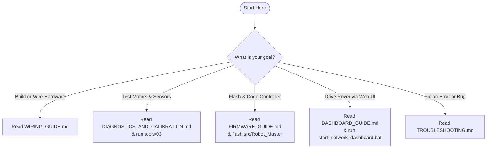
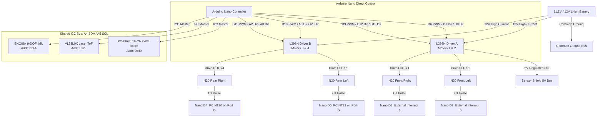

# 📚 Autonomous 4WD N20 Rover: Master Documentation Hub

Welcome to the comprehensive technical documentation for the **Autonomous 4WD N20 Rover (IIT-RB2)**. This repository houses the complete hardware specifications, direct-pinout firmware, diagnostic test suite, and interactive ground control dashboard.

---

## 🗺️ Documentation Library

The documentation is organized into modular guides tailored for hardware assembly, firmware development, telemetry operations, and troubleshooting:

| Guide | Description | Primary Target |
| :--- | :--- | :--- |
| **[Hardware & Wiring Guide](WIRING_GUIDE.md)** | Pinout maps, dual L298N motor drivers, interrupt encoders, I2C bus, and power distribution. | Hardware Engineers & Assembly |
| **[Firmware Architecture Guide](FIRMWARE_GUIDE.md)** | Deep dive into `Robot_Master.ino` and `Robot_Simple.ino`, timers, interrupts, state machines, and protocols. | Embedded C++ Developers |
| **[Telemetry & Dashboard Guide](DASHBOARD_GUIDE.md)** | Web Serial API, Network HTTP/Serial Bridge (`serve_dashboard.ps1`), UI controls, and REST API. | Field Operators & Telemetry |
| **[Diagnostics & Calibration Guide](DIAGNOSTICS_AND_CALIBRATION.md)** | Interactive bench self-test suite (`tools/`), motor polarity verification, and encoder calibration. | Bench Calibration & QA |
| **[Troubleshooting & FAQ Guide](TROUBLESHOOTING.md)** | Comprehensive solutions for common motor, power brownout, I2C freeze, and bootloader issues. | Field Repair & Debugging |
| **[Diagnostic Tools Directory](../tools/README.md)** | Quick reference and upload instructions for the 3 standalone Arduino diagnostic sketches. | Bench Testing |

---

## 🎯 Quick Navigation: What are you trying to do?



### 1. Assembling & Wiring the Rover
* Follow the **[Hardware & Wiring Guide](WIRING_GUIDE.md)**.
* Check the **Master Pinout Table** to ensure conflict-free pin assignments.
* Review **Motor Polarity & Mechanical Mirroring** to prevent your rover from spinning in place.
* Review the **Power Distribution & Common Ground Plane** checklist.

### 2. Bench Testing Hardware (Before Driving)
* Follow the **[Diagnostics & Calibration Guide](DIAGNOSTICS_AND_CALIBRATION.md)**.
* Upload `tools/01_I2C_Scanner` to verify your VL53L0X (`0x29`) and BNO08x (`0x4A`) respond on the I2C bus.
* Upload `tools/03_Direct_Hardware_Diagnostic_Test` to test each motor channel individually and verify real-time encoder pulse feedback.

### 3. Flashing Production Firmware
* Consult the **[Firmware Architecture Guide](FIRMWARE_GUIDE.md)**.
* Load `src/Robot_Master/Robot_Master.ino` into Arduino IDE or VS Code.
* Set Board to **Arduino Nano**, Processor to **ATmega328P (Old Bootloader)**, and upload.
* Serial communication runs at **115200 baud**.

### 4. Operating the Web Dashboard & Telemetry
* Consult the **[Telemetry & Dashboard Guide](DASHBOARD_GUIDE.md)**.
* Double-click `start_dashboard.bat` (or execute `powershell -File dashboard/serve_dashboard.ps1 -Port 8080`).
* Open `http://localhost:8080/` in Google Chrome or Microsoft Edge.
* To control wirelessly from a phone or tablet, connect to the same Wi-Fi network and open `http://<YOUR_PC_IP>:8080/`.

### 5. Resolving Issues & Errors
* Consult the **[Troubleshooting & FAQ Guide](TROUBLESHOOTING.md)** for systematic symptom-to-solution matrices covering motor direction inversion, MCU brownouts, I2C lockups, and serial permission conflicts.

---

## 🏗️ System Overview & Topography

The rover employs a direct-drive, conflict-free architecture designed specifically for the **ATmega328P** on an **Arduino Nano V3** with a **Sensor Shield V3**:



---

## 📁 Repository Directory Structure

```text
IIT-RB2-main/
├── docs/                                    # 📚 Technical Documentation Hub
│   ├── README.md                            # Documentation Index (This file)
│   ├── WIRING_GUIDE.md                      # Master Hardware Wiring & Pinout Guide
│   ├── FIRMWARE_GUIDE.md                    # Firmware Architecture & Protocol Spec
│   ├── DASHBOARD_GUIDE.md                   # Telemetry Dashboard & Network Bridge Spec
│   ├── DIAGNOSTICS_AND_CALIBRATION.md       # Bench Self-Test & Calibration Procedures
│   └── TROUBLESHOOTING.md                   # Field & Bench Troubleshooting Guide
│
├── src/                                     # 💻 Embedded Firmware Sketches
│   ├── Robot_Master/                        # Production Autonomous & Teleop Controller
│   │   └── Robot_Master.ino                 # Master Arduino Nano Firmware (115200 Baud)
│   └── Robot_Simple/                        # Standalone Obstacle Avoidance Trial
│       └── Robot_Simple.ino                 # Simplified ToF Test Firmware (9600 Baud)
│
├── tools/                                   # 🛠 Standalone Bench Diagnostic Tools
│   ├── README.md                            # Diagnostic Tools Overview & Instructions
│   ├── 01_I2C_Scanner/                      # Automated I2C Address Discovery (9600 Baud)
│   ├── 02_PCA9685_Motor_Test/               # Auxiliary PWM Expansion Bench Test
│   └── 03_Direct_Hardware_Diagnostic_Test/  # Full Interactive System Diagnostics (115200 Baud)
│
├── include/                                 # 📦 Bundled C++ Sensor Driver Headers
│   ├── VL53L0X.h                            # ST VL53L0X Time-of-Flight Laser Driver
│   └── SparkFun_BNO080_Arduino_Library.h    # CEVA / Hillcrest BNO08x 9-DOF AHRS Driver
│
├── dashboard/                               # 🌐 Web Ground Station & Network Bridge
│   ├── index.html                           # Primary Web Telemetry Dashboard UI
│   ├── Robot_2_Dashboard.html               # Alternate Dashboard Entrypoint
│   ├── serve_dashboard.ps1                  # Zero-Dependency HTTP & Serial Bridge Server
│   └── start_network_dashboard.bat          # Dedicated Server Launcher
│
├── start_dashboard.bat                      # 🚀 One-Click Root Launcher for Dashboard
├── README.md                                # Root Project Summary & Navigation Portal
└── LICENSE                                  # Project License
```

---

## ⚡ Master Specification Matrix

| Metric / Parameter | Value | Reference Link |
| :--- | :--- | :--- |
| **Microcontroller** | ATmega328P (16 MHz, 5V Logic) | [Hardware Guide](WIRING_GUIDE.md#2-master-arduino-nano-pin-assignment) |
| **Drive Architecture** | 4WD Skid-Steering, Dual L298N H-Bridges | [Hardware Guide](WIRING_GUIDE.md#3-l298n-motor-driver-wiring) |
| **PWM Speed Pins** | `D6` (Timer0), `D9` (Timer1), `D10` (Timer1), `D11` (Timer2) | [Firmware Guide](FIRMWARE_GUIDE.md#hardware-pin--timer-mapping) |
| **Odometry Resolution** | 4x Dedicated Interrupts (`D2`, `D3`, `D4`, `D5`) | [Hardware Guide](WIRING_GUIDE.md#4-encoder-connections-c1-signals) |
| **Distance Ranging** | VL53L0X Laser ToF (`0x29`, up to 2000 mm) | [Firmware Guide](FIRMWARE_GUIDE.md#sensor-integration-pipeline) |
| **Inertial Navigation** | BNO08x 9-DOF AHRS (`0x4A`, Yaw/Pitch/Roll) | [Firmware Guide](FIRMWARE_GUIDE.md#sensor-integration-pipeline) |
| **Telemetry Interface** | Web Serial API / Localhost & Wi-Fi HTTP Bridge | [Dashboard Guide](DASHBOARD_GUIDE.md#architecture-overview) |
| **Production Serial Speed** | 115200 Baud (`8-N-1`) | [Firmware Guide](FIRMWARE_GUIDE.md#serial-command-protocol) |
| **Bootloader Upload** | `ATmega328P (Old Bootloader)` @ 57600 Baud | [Diagnostics Guide](DIAGNOSTICS_AND_CALIBRATION.md#upload-settings) |
