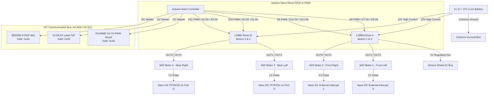

# Master Wiring & System Architecture Guide: 4WD N20 Rover

> 📖 **Part of the [IIT-RB2 Documentation Suite](README.md)**  
> **Related Guides:** [Firmware Architecture](FIRMWARE_GUIDE.md) | [Dashboard & Telemetry](DASHBOARD_GUIDE.md) | [Diagnostics & Calibration](DIAGNOSTICS_AND_CALIBRATION.md) | [Troubleshooting & FAQ](TROUBLESHOOTING.md)

This document provides the complete hardware wiring specifications, pin assignments, electrical distribution, and communication bus topography for the 4WD N20 Rover based on the audited direct-pinout architecture.

---

## 1. System Architecture Overview

---

## 2. Master Arduino Nano Pin Assignment

| Arduino Nano Pin | Shield Row | Connected Subsystem / Signal | Hardware Function | Status |
| :--- | :--- | :--- | :--- | :--- |
| **D0 (RX)** | D0 (S) | **UNCONNECTED** | USB Serial Upload & Debug | ✅ Safe & Free |
| **D1 (TX)** | D1 (S) | **UNCONNECTED** | USB Serial Upload & Debug | ✅ Safe & Free |
| **D2** | D2 (S) | **Motor 1 Encoder Signal (C1)** | External Interrupt 0 (`INT0`) | ✅ Dedicated |
| **D3** | D3 (S) | **Motor 2 Encoder Signal (C1)** | External Interrupt 1 (`INT1`) | ✅ Dedicated |
| **D4** | D4 (S) | **Motor 4 Encoder Signal (C1)** | Pin Change Interrupt (`PCINT20`) | ✅ Dedicated |
| **D5** | D5 (S) | **Motor 3 Encoder Signal (C1)** | Pin Change Interrupt (`PCINT21`) | ✅ Dedicated |
| **D6** | D6 (S) | **Driver A: ENA (Motor 1 Speed)** | Hardware PWM (`Timer0A`) | ✅ Dedicated |
| **D7** | D7 (S) | **Driver A: IN1 (Motor 1 Dir A)** | Digital GPIO | ✅ Dedicated |
| **D8** | D8 (S) | **Driver A: IN2 (Motor 1 Dir B)** | Digital GPIO | ✅ Dedicated |
| **D9** | D9 (S) | **Driver A: ENB (Motor 2 Speed)** | Hardware PWM (`Timer1A`) | ✅ Dedicated |
| **D10** | D10 (S) | **Driver B: ENA (Motor 3 Speed)** | Hardware PWM (`Timer1B`) | ✅ Dedicated |
| **D11** | D11 (S) | **Driver B: ENB (Motor 4 Speed)** | Hardware PWM (`Timer2A`) | ✅ Dedicated |
| **D12** | D12 (S) | **Driver A: IN3 (Motor 2 Dir A)** | Digital GPIO | ✅ Dedicated |
| **D13** | D13 (S) | **Driver A: IN4 (Motor 2 Dir B)** | Digital GPIO (Onboard LED line) | ✅ Dedicated |
| **A0** | A0 (S) | **Driver B: IN1 (Motor 3 Dir A)** | Digital GPIO (`D14`) | ✅ Dedicated |
| **A1** | A1 (S) | **Driver B: IN2 (Motor 3 Dir B)** | Digital GPIO (`D15`) | ✅ Dedicated |
| **A2** | A2 (S) | **Driver B: IN3 (Motor 4 Dir A)** | Digital GPIO (`D16`) | ✅ Dedicated |
| **A3** | A3 (S) | **Driver B: IN4 (Motor 4 Dir B)** | Digital GPIO (`D17`) | ✅ Dedicated |
| **A4 (SDA)** | A4 (S) / SDA | **I2C Bus Data Line** | Hardware I2C (PCA9685, VL53L0X, BNO08x) | ✅ Shared Bus |
| **A5 (SCL)** | A5 (S) / SCL | **I2C Bus Clock Line** | Hardware I2C (PCA9685, VL53L0X, BNO08x) | ✅ Shared Bus |
| **A6** | A6 (S) | Spare Analog Input Only | Available (e.g. Battery Voltage Divider) | ⚪ Spare |
| **A7** | A7 (S) | Spare Analog Input Only | Available (e.g. Current Sense) | ⚪ Spare |
| **5V (V)** | All V pins | **+5V Logic Power Rail** | Powered from Driver A 5V Regulator | ✅ Connected |
| **GND (G)** | All G pins | **Common Ground Plane** | Common Ground for all logic & battery | ✅ Connected |

---

## 3. L298N Motor Driver Wiring

### Driver A (Motors 1 & 2: Front Left & Front Right)
| L298N-A Terminal | Target Motor | Arduino Nano Pin | Shield Header | Function / Signal |
| :--- | :--- | :--- | :--- | :--- |
| **ENA** | Motor 1 | **D6** | D6 (S) | Speed PWM (0–255) |
| **IN1** | Motor 1 | **D7** | D7 (S) | Direction Bit A |
| **IN2** | Motor 1 | **D8** | D8 (S) | Direction Bit B |
| **IN3** | Motor 2 | **D12** | D12 (S) | Direction Bit A |
| **IN4** | Motor 2 | **D13** | D13 (S) | Direction Bit B |
| **ENB** | Motor 2 | **D9** | D9 (S) | Speed PWM (0–255) |
| **OUT1 / OUT2** | Motor 1 | — | — | Front Left N20 Terminals |
| **OUT3 / OUT4** | Motor 2 | — | — | Front Right N20 Terminals |

### Driver B (Motors 3 & 4: Rear Left & Rear Right)
| L298N-B Terminal | Target Motor | Arduino Nano Pin | Shield Header | Function / Signal |
| :--- | :--- | :--- | :--- | :--- |
| **ENA** | Motor 3 | **D10** | D10 (S) | Speed PWM (0–255) |
| **IN1** | Motor 3 | **A0** | A0 (S) | Direction Bit A |
| **IN2** | Motor 3 | **A1** | A1 (S) | Direction Bit B |
| **IN3** | Motor 4 | **A2** | A2 (S) | Direction Bit A |
| **IN4** | Motor 4 | **A3** | A3 (S) | Direction Bit B |
| **ENB** | Motor 4 | **D11** | D11 (S) | Speed PWM (0–255) |
| **OUT1 / OUT2** | Motor 3 | — | — | Rear Left N20 Terminals |
| **OUT3 / OUT4** | Motor 4 | — | — | Rear Right N20 Terminals |

*Note on Driver B Channels:*
* `OUT1 / OUT2` driven by `IN1/IN2 (A0/A1)` connects to **Motor 3**.
* `OUT3 / OUT4` driven by `IN3/IN4 (A2/A3)` connects to **Motor 4**.

> [!IMPORTANT]
> **Motor Polarity & Mechanical Mirroring (Crucial Bench Setup):**
> Because motors on the right side of the chassis (M2 and M4) face the opposite physical direction of motors on the left side (M1 and M3), connecting all red wires to OUT1/OUT3 and black wires to OUT2/OUT4 will cause the rover to spin in circles instead of moving straight!
> - **Left Wheels (M1 & M3):** Wire positive terminal to OUT1, negative to OUT2.
> - **Right Wheels (M2 & M4):** Wire positive terminal to OUT4, negative to OUT3 (reversed leads), OR verify with Diagnostic Tool `03` (Option `1` through `4`) so that commanding "FORWARD" spins both left and right wheels in the forward travel direction.

---

## 4. Encoder Connections (C1 Signals)

All 4 encoder 3-wire interfaces plug directly into the Sensor Shield 3-pin headers `(V, G, S)`:

| Physical Motor | VCC Pin | GND Pin | Signal Pin (C1) | Shield Header | Interrupt Architecture |
| :--- | :--- | :--- | :--- | :--- | :--- |
| **Motor 1 (Front Left)** | VCC | GND | C1 | **D2** (V, G, S) | External Interrupt 0 (`INT0`) |
| **Motor 2 (Front Right)**| VCC | GND | C1 | **D3** (V, G, S) | External Interrupt 1 (`INT1`) |
| **Motor 3 (Rear Left)** | VCC | GND | C1 | **D5** (V, G, S) | Pin Change Interrupt 2 (`PCINT21`) |
| **Motor 4 (Rear Right)**| VCC | GND | C1 | **D4** (V, G, S) | Pin Change Interrupt 2 (`PCINT20`) |

> **Interrupt Tip:** Both D4 and D5 reside on `PORT D` (`PIND4` and `PIND5`). They share the vector `ISR(PCINT2_vect)`. Within the ISR, the software performs instantaneous bit masking against the previous state (`lastPIND`) to count rising-edge pulses independently, matching the resolution of INT0/INT1 on D2/D3.

---

## 5. Shared I2C Bus Connections

The PCA9685, VL53L0X, and BNO08x connect in parallel to the Arduino Nano hardware I2C lines (`A4` and `A5`):

| Device | SDA Pin | SCL Pin | VCC Pin | GND Pin | I2C Address | Logic Level |
| :--- | :--- | :--- | :--- | :--- | :--- | :--- |
| **PCA9685 Board** | A4 Header | A5 Header | 5V Header | GND Header | `0x40` | 5V Tolerant |
| **VL53L0X ToF Sensor** | A4 Header | A5 Header | 5V Header (or 3.3V) | GND Header | `0x29` | Breakout with LDO & Level Shifter |
| **BNO08x 9-DOF IMU** | A4 Header | A5 Header | 5V Header (or 3.3V) | GND Header | `0x4A` (or `0x4B`) | Breakout with LDO & Level Shifter |

> [!NOTE]
> **I2C Voltage Level Safety:**
> - The native VL53L0X and BNO080 ICs run at 2.8V / 3.3V logic.
> - Ensure your sensor breakout modules include onboard 3.3V LDO regulators and bidirectional MOSFET level shifters (standard on SparkFun, Adafruit, and CJMCU/GY breakout boards) before powering from the Sensor Shield 5V rail.
> - The BNO08x default address is `0x4A` when its DI0/ADDR pin is tied to GND. If left floating or high, it responds at `0x4B`.

---

## 6. Power Distribution & Safety Checklist

1. **High-Current Battery Rail:** Connect Li-ion battery positive lead (+) directly to the **+12V screw terminals** on both Driver A and Driver B.
2. **Logic Power Rail (5V):** Use the regulated **5V output terminal** of Driver A (with its onboard 5V regulator jumper closed) to feed the Sensor Shield **5V bus**.
3. **Common Ground:** Tie Li-ion battery (-), Driver A GND, Driver B GND, Sensor Shield GND, and PCA9685 GND into one unified ground plane.
4. **USB Flashing Safety:** D0 (RX) and D1 (TX) are 100% free of motor or sensor connections. USB sketch flashing will never conflict with peripheral lines.
5. **No Analog Output Bugs:** Standard ATmega328P pins A6 and A7 are analog-input only. Motor directions exclusively use true digital I/O lines (D7, D8, D12, D13, A0–A3).
6. **Dual 5V Rail Protection:** When the Arduino Nano is connected to a computer via USB while the battery is off, the Nano draws 5V from USB. To prevent the L298N regulator from competing with USB 5V, power on the battery switch first before plugging in USB, or disconnect the L298N 5V jumper when programming in isolation.
7. **Pin D13 Bootloader Pulse:** Pin D13 drives Motor 2 Direction Bit B and also drives the Nano's onboard LED. During MCU bootloader flashing or hardware reset, the bootloader pulses D13. This causes no harm, but keep the robot propped on a bench stand during firmware flashing so wheels don't twitch.
8. **Firmware Baud Rate Reference Table:**
   | Sketch / Tool | File Path | Baud Rate | Notes |
   | :--- | :--- | :---: | :--- |
   | **Robot Master Controller** | `src/Robot_Master/Robot_Master.ino` | **115200** | Production firmware with Web Dashboard link |
   | **Direct Hardware Diagnostics** | `tools/03_Direct_Hardware_Diagnostic_Test/` | **115200** | Interactive calibration & self-test suite |
   | **Simple Obstacle Trial** | `src/Robot_Simple/Robot_Simple.ino` | **9600** | Standalone ToF obstacle test |
   | **I2C Bus Discovery** | `tools/01_I2C_Scanner/` | **9600** | Peripheral discovery tool |
   | **PCA9685 Expansion Test** | `tools/02_PCA9685_Motor_Test/` | **9600** | Bench verification sketch |
