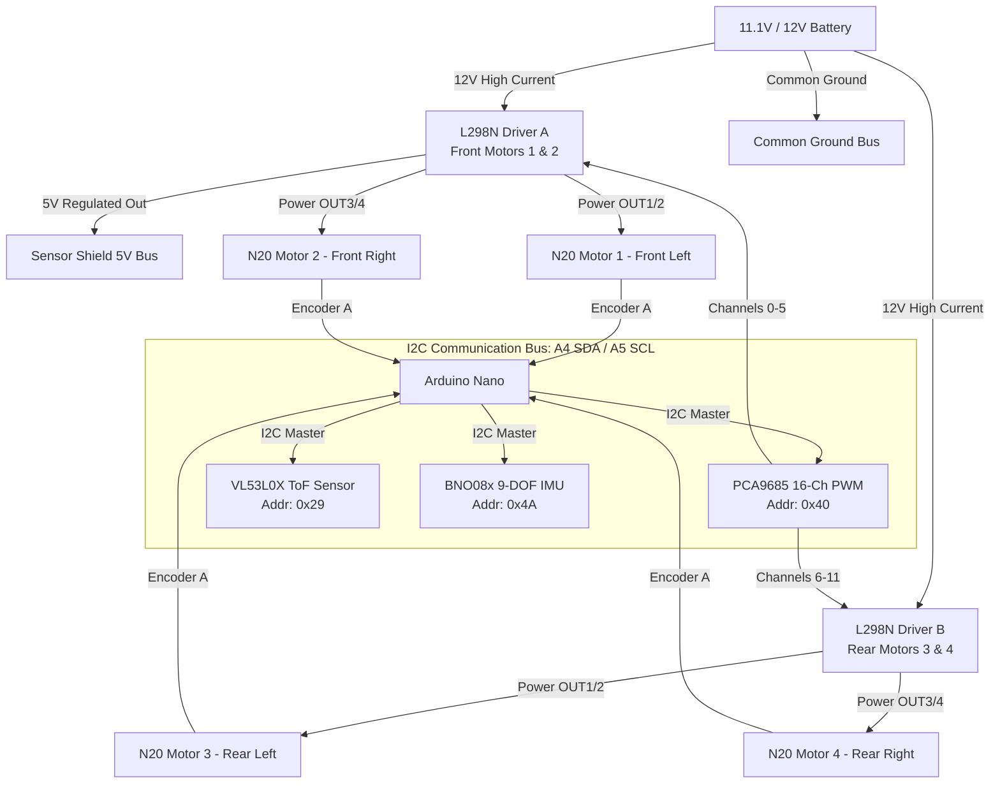

# Master Wiring & System Architecture Guide: 4WD N20 Rover

This document provides the complete hardware wiring specifications, pin assignments, electrical distribution, and communication bus topography for the 4WD N20 Rover.

---

## 1. System Architecture Overview

---

## 2. I2C Bus Connections (The Shared Spine)

All three peripheral modules share the **I2C data line (A4)** and **I2C clock line (A5)**. Connect them in parallel using the Sensor Shield I2C header or breadboard bus.

| Device | Module Pin | Arduino Nano Pin | Sensor Shield Pin | Purpose / Notes |
| :--- | :--- | :--- | :--- | :--- |
| **Common I2C** | **SDA** | **A4** | **A4 (S)** | I2C Data line (Hardware Pull-up) |
| **Common I2C** | **SCL** | **A5** | **A5 (S)** | I2C Clock line |
| **Power Bus** | **VCC / VIN**| **5V** | **5V (V)** | Logic Supply (5V) |
| **Power Bus** | **GND** | **GND** | **GND (G)** | Common Logic Ground |

### I2C Device Address Map (No Conflicts)
* **`0x29`**: **VL53L0X** (Time-of-Flight Laser Distance Sensor)
* **`0x40`**: **PCA9685** (16-Channel 12-bit PWM Controller)
* **`0x4A`**: **BNO08x** (9-DOF IMU / AHRS Gyroscope & Accelerometer)

---

## 3. PCA9685 to L298N Motor Driver Wiring

By offloading all 12 motor signals to the PCA9685, the Arduino Nano uses **zero direct digital pins** for motor control!

Connect the L298N logic terminals directly to the **Signal (S)** pins of the PCA9685 channel headers (the yellow/white row marked `PWM` or `S`):

### Driver A (Motors 1 & 2: Front Left & Front Right)
| L298N-A Terminal | Target PCA9685 Channel | PCA9685 Pin Row | Function / Signal |
| :--- | :--- | :--- | :--- |
| **ENA** | **Channel 0** | **Ch 0 (S)** | Motor 1 Speed (12-bit PWM: 0–4095) |
| **IN1** | **Channel 1** | **Ch 1 (S)** | Motor 1 Direction A (Full ON / Full OFF) |
| **IN2** | **Channel 2** | **Ch 2 (S)** | Motor 1 Direction B (Full ON / Full OFF) |
| **IN3** | **Channel 3** | **Ch 3 (S)** | Motor 2 Direction A (Full ON / Full OFF) |
| **IN4** | **Channel 4** | **Ch 4 (S)** | Motor 2 Direction B (Full ON / Full OFF) |
| **ENB** | **Channel 5** | **Ch 5 (S)** | Motor 2 Speed (12-bit PWM: 0–4095) |

### Driver B (Motors 3 & 4: Rear Left & Rear Right)
| L298N-B Terminal | Target PCA9685 Channel | PCA9685 Pin Row | Function / Signal |
| :--- | :--- | :--- | :--- |
| **ENA** | **Channel 6** | **Ch 6 (S)** | Motor 3 Speed (12-bit PWM: 0–4095) |
| **IN1** | **Channel 7** | **Ch 7 (S)** | Motor 3 Direction A (Full ON / Full OFF) |
| **IN2** | **Channel 8** | **Ch 8 (S)** | Motor 3 Direction B (Full ON / Full OFF) |
| **IN3** | **Channel 9** | **Ch 9 (S)** | Motor 4 Direction A (Full ON / Full OFF) |
| **IN4** | **Channel 10**| **Ch 10 (S)**| Motor 4 Direction B (Full ON / Full OFF) |
| **ENB** | **Channel 11**| **Ch 11 (S)**| Motor 4 Speed (12-bit PWM: 0–4095) |

*Note: Channels 12, 13, 14, and 15 on the PCA9685 remain free for future additions (pan/tilt camera servos, robotic arm, headlights, etc.).*

---

## 4. BNO08x (BNO080 / BNO085) 9-DOF IMU Wiring

The BNO08x is a high-precision sensor running Hillcrest Laboratories' SH-2 sensor hub firmware to give drift-free fused Euler angles (Heading/Yaw, Pitch, Roll) and quaternions.

| BNO08x Pin | Arduino Nano Pin | Sensor Shield Header | Description |
| :--- | :--- | :--- | :--- |
| **VIN** | **5V** | **5V (V)** | Module power (onboard regulator to 3.3V) |
| **GND** | **GND** | **GND (G)** | Common ground |
| **SCL** | **A5** | **A5 (S)** | I2C Clock |
| **SDA** | **A4** | **A4 (S)** | I2C Data |
| **INT / H_INT**| **D2** | **D2 (S)** | Hardware Host Interrupt (Active LOW packet alert) |
| **RST** | **D12** (or 5V) | **D12 (S)** | Hardware Reset pin (controlled by Nano) |
| **DI0 / ADDR**| **GND** | **GND (G)** | Sets default I2C address to `0x4A` |

---

## 5. VL53L0X Time-of-Flight Distance Sensor Wiring

The VL53L0X emits an invisible 940nm VCSEL laser pulse to measure millimetric distance up to 2 meters, completely immune to target color and reflectance.

| VL53L0X Pin | Arduino Nano Pin | Sensor Shield Header | Description |
| :--- | :--- | :--- | :--- |
| **VIN** | **5V** | **5V (V)** | Sensor power (Module has 2.8V regulator) |
| **GND** | **GND** | **GND (G)** | Common ground |
| **SCL** | **A5** | **A5 (S)** | I2C Clock |
| **SDA** | **A4** | **A4 (S)** | I2C Data |
| **XSHUT** | **NC / 5V** | — | Shutdown control (leave disconnected or pulled HIGH) |
| **GPIO1** | **NC** | — | Optional interrupt (leave disconnected) |

---

## 6. N20 Encoders to Arduino Nano

With the PCA9685 handling all motor driving, the Arduino Nano's digital pins are dedicated purely to pulse-counting and sensor interrupts:

| Motor | Signal | Arduino Nano Pin | Interrupt Type |
| :--- | :--- | :--- | :--- |
| **Motor 1 (Front Left)** | Channel A (C1) | **D3** | External Interrupt `INT1` |
| **Motor 2 (Front Right)**| Channel A (C1) | **D4** | Pin Change Interrupt (`PCINT20`) |
| **Motor 3 (Rear Left)** | Channel A (C1) | **D7** | Pin Change Interrupt (`PCINT23`) |
| **Motor 4 (Rear Right)**| Channel A (C1) | **D8** | Pin Change Interrupt (`PCINT0`) |

*All 4 encoder 5V and GND lines connect to the **5V (V)** and **GND (G)** buses on the shield or breadboard.*

---

## 7. Power Distribution & Safety Rules

1. **High Current Rail:** Battery (+) goes ONLY to the **12V screw terminals** on both L298N drivers. Never feed high battery voltage to the Arduino pins.
2. **PCA9685 Power:**
   * **VCC pin (Logic):** Connect to Arduino Shield **5V**.
   * **GND pin (Logic):** Connect to Common **GND**.
   * **V+ Screw Terminal:** This is only used for high-current servos. Since the PCA9685 is only sending 5V logic signals to the L298N inputs, **leave the green V+ screw terminal empty**.
3. **Common Ground:** Battery (-), both L298N GNDs, PCA9685 GND, BNO08x GND, VL53L0X GND, and Arduino GND must share one continuous connection.
4. **USB Flashing Safety:** Switch OFF or disconnect the battery when flashing code over the Mac USB cable.
